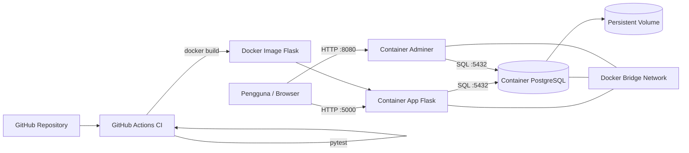

# Diagram Arsitektur

Penjelasan:
- Pengguna mengakses aplikasi Flask melalui port 5000.
- Aplikasi berkomunikasi dengan PostgreSQL menggunakan nama service `db` pada internal Docker network.
- Adminer menjadi service ketiga untuk pemeriksaan database.
- Data PostgreSQL disimpan pada named volume `cloudtask-postgres-data`.
- GitHub Actions menjalankan automated testing sebelum Docker image dibangun.
